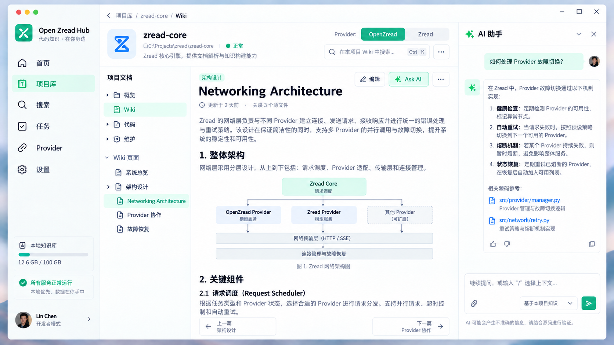
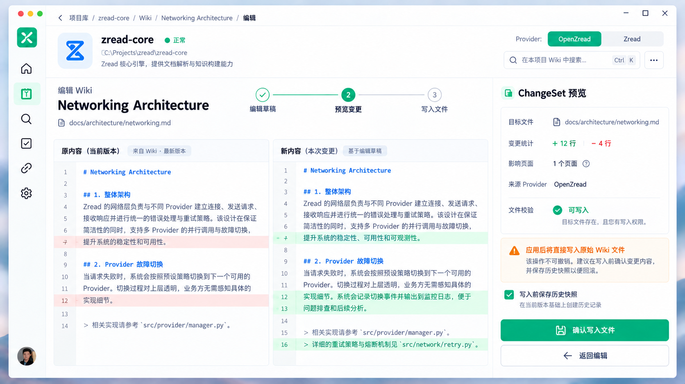

# Open Zread Hub 布局与 UX 改造方案 v0.1

状态：供评审的设计提案。目标平台：Windows 桌面端，Tauri + React。参考 [Zread 首页](https://zread.ai/) 的内容优先导航、[Zread 项目页](https://zread.ai/pret/pokefirered) 的项目阅读结构，并结合本项目既有的双 Provider、生成、编辑和写回原文件能力。

## 设计图

| 场景 | 设计图 | 重点 |
| --- | --- | --- |
| 首页 |  | 最近项目、继续阅读、任务及 Provider 简要状态 |
| 项目阅读 |  | 项目导航、Wiki 阅读、按需打开的 AI 侧栏 |
| 变更审核 |  | 原文/新文对比、文件校验、确认写回 |

设计图用于评审布局、层级和视觉方向；其中项目名、任务进度、源码路径及示例文章内容是示意数据，不代表当前产品数据或已实现的能力。最终界面文案及数值由真实状态驱动。

## 核心问题与目标

当前首页把搜索、服务健康、Provider 诊断、项目操作、Reader 和任务状态按纵向顺序排列。用户打开一个 Wiki 后仍留在项目库长页面中；新增、编辑、历史、AI 和 ChangeSet 又在 Reader 内展开，阅读位置容易跳动。项目卡片一次展示大量按钮，主要动作缺乏优先级。

改造目标：让用户在首页快速回到项目；进入项目后稳定阅读 Wiki；需要编辑时进入清楚的草稿、审核和写回流程。完整保留 OpenZread/Zread 双 Provider 能力及原文件写回语义。

## 信息架构

```text
应用导航
├─ 首页：最近项目、收藏、最近阅读、当前任务
├─ 项目库：所有本地项目，搜索/筛选/新增
├─ 搜索：跨项目 Wiki 搜索
├─ 任务：生成、同步、失败与历史状态
├─ Provider：可用性、配置和诊断
└─ 设置：桌面应用与外观设置

项目工作区
├─ 概览：项目摘要、两种 Wiki 状态、快捷操作
├─ Wiki：Provider 选择、章节树、文章阅读
├─ 代码：源文件查看；从文章引用进入
├─ 维护：生成、同步、历史与恢复
└─ 项目设置：路径、迁移、移除等低频操作
```

这些是导航目标和页面职责，不要求首轮补齐尚未实现的后端能力。项目“代码”入口可先承接现有的关联源文件阅读；不展示无法执行的动作。

## 布局规格

### 首页

- 1600×900 设计基准；应用导航展开宽 240px，收起宽 56px。主内容区采用最大约 1320px 的弹性容器。
- 顶栏高度约 64px，容纳全局搜索、快捷键提示、任务通知和账户/设置入口。
- 首屏顺序：简短欢迎信息 → 最近项目（最多三张主卡）→ 收藏/最近阅读 → 当前任务与 Provider 摘要。
- 项目卡仅保留一个主动作“打开项目”；生成、同步、路径和终端操作归入更多菜单或项目工作区。危险操作只出现在项目设置中。
- 服务版本、exe 路径、运行参数及诊断信息归入 Provider 页面，首页只显示“正常 / 需关注”。

### 项目阅读页

- 全局导航 240px；项目章节导航约 220–240px；文章区弹性伸缩，正文理想行宽 68–82 个中文字符；右侧上下文面板打开时约 320–360px。
- 应用顶栏保留项目面包屑；Wiki 工作区不常驻重复的项目摘要卡（路径、可用状态、打开目录等），这些低频资料在项目设置中查看。Provider 切换、新建页面、历史恢复和问答入口与项目导航共用一行并靠右排列；导航栏下方直接进入章节树和文章，不再显示独立 Reader 标题卡或空白控制栏。
- 章节树独立滚动，当前章节有清晰的选中态。分组标题使用中性辅助色和中等字重，页面标题使用清晰易读的正文层级，选中项以浅薄荷底色和品牌色区分；折叠控件使用线性箭头图标。可读状态不在每个页面标题旁重复显示，仅对不可读页面给出明确状态。文章在自己的滚动区域中阅读，标题、更新时间、关联源文件及上/下一篇留在文章上下文内。
- AI 问答、源码预览、页面元数据和历史记录使用右侧上下文面板；同一时间只显示一种上下文。关闭后文章恢复宽度。
- 编辑文章切换到独立编辑状态；新增主题使用分步流程，不在正文上方展开整页表单。

### ChangeSet 审核页

- 编辑流程明确为“编辑草稿 → 预览变更 → 写入文件”。AI 改写和手动编辑使用同一个审核入口。
- 审核区域展示原文/新文差异、目标文件、增删行数、影响页面和文件可写性。多文件变更显示文件列表，逐个切换差异。
- “确认写入文件”是唯一主按钮；“返回编辑”和放弃草稿是次级动作。明确提示应用后直接修改原始 Wiki 文件。
- 写入成功后回到原文章，保持章节定位，显示保存结果并提供历史入口；写入失败时保留草稿和 ChangeSet，展示可操作的失败原因。

## 关键交互规则

1. 点击项目卡进入独立项目工作区；返回首页后保留项目列表的搜索和滚动位置。
2. 从跨项目搜索结果进入对应项目、Provider 和章节，并定位到匹配内容；返回搜索时保留查询和结果。
3. 切换 Provider 时直接恢复该 Provider 自己最近阅读的章节和滚动位置，不按同名标题或 slug 自动对齐。该 Provider 原页面已不存在时进入其概览并说明原因。
4. 生成/同步任务不占用阅读正文。全局任务入口持续显示运行状态，任务详情在抽屉中查看；失败通知提供重试及诊断入口。
5. 提交 AI 草稿后，用户可以检查内容、编辑草稿、预览差异，再确认写回。AI 回答引用当前项目真实文件，引用可打开源文件位置。
6. 删除、迁移、历史恢复等高影响操作提供明确的目标和结果说明；不可用的操作显示原因。

## 视觉规范

| 项目 | 建议 |
| --- | --- |
| 页面背景 | 暖白 `#FCFBF8`，主内容白色 `#FFFFFF` |
| 品牌色 | 青绿 `#00B0AA`，选中态使用低饱和浅薄荷背景 |
| 正文/辅助文字 | 深炭灰与中性灰，避免多种蓝灰互相竞争 |
| 边框 | 接近 `#E5E7EB` 的细边框；阴影只用于浮层 |
| 字体 | Geist、Noto Sans SC，Windows 回退到 Segoe UI / Microsoft YaHei UI；代码使用 JetBrains Mono / Consolas |
| 图标 | 统一线性图标，16/20px 两档；按钮文字保留可读标签 |
| 圆角与间距 | 卡片 8–12px 圆角；8/12/16/24/32px 间距序列 |
| 按钮 | 一个主动作、若干次动作；删除和不可逆写入有明确语义 |

可保留现有浅色基调，但应减弱整页蓝色渐变和大面积阴影，强化文章阅读区的安静感。以上色值是提案，最终以真实界面中的对比度和 Windows 字体渲染效果校准。

## 窗口宽度与可访问性

- 宽度 ≥ 1440px：展开应用导航；项目导航与 AI 面板可同时显示。
- 宽度 1100–1439px：应用导航可收起；AI 面板覆盖或压缩少量文章区域，正文保持可读行宽。
- 宽度 960–1099px：应用导航默认收起；项目导航/AI 面板转为抽屉，保持正文优先。避免当前 `body` 最小宽度导致的横向裁切。
- 搜索、章节树、Provider 切换和编辑流程均支持键盘。抽屉有焦点管理、Esc 关闭、明确的可访问名称；状态变化使用非干扰通知。

## 实施顺序与验收

1. 建立应用壳层、导航状态、设计 token 和基础组件；首页与项目工作区成为两个独立视图。
2. 重构首页项目卡和任务/Provider 摘要；保持现有项目管理能力可达。
3. 重构项目阅读页和双 Provider 切换；保持章节、滚动和源文件引用能力。
4. 将新增、编辑、AI、历史和 ChangeSet 调整为上下文面板及独立审核流程；保持直接写回原文件和历史恢复。
5. 适配窗口宽度、键盘、加载/空/错误状态，回归完整主路径。

验收主路径：启动应用 → 最近项目 → 打开 Wiki → 切换 Provider → 选章节 → 提问或编辑 → 预览 ChangeSet → 确认写回 → 返回已更新文章。该路径应避免整页滚动跳动，任何关键操作最多经过一个上下文面板或一个独立审核页。

## 待确认的产品取舍

- 首页保留多少“发现”属性：首版建议仅展示本地项目和本地 Wiki，不引入在线仓库发现。
- 项目导航是否显示“代码”：建议保留入口，但首版只实现从关联源文件进入的只读查看。
- AI 面板打开时宽度不足的处理：建议改为覆盖式抽屉，不压缩文章到难以阅读。
